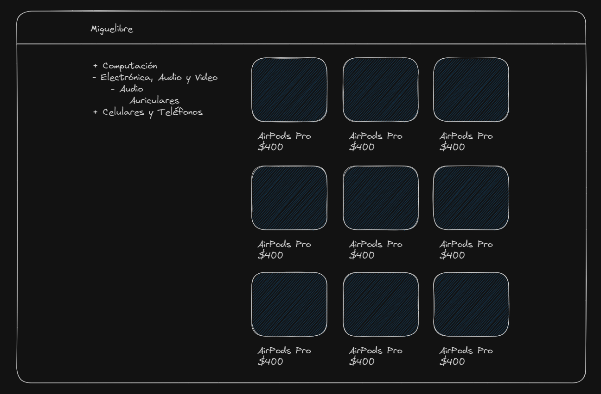

# Interview Exercise, Free Migration

Don Miguel has been selling on Mercado Libre for 10 years, but he has a problem: he suffers from [xanthophobia](https://www.autopista.es/planeta2030/es-xantofobia_269191_102.html#:~:text=La%20xantofobia%20se%20refiere%20al,sea%20o%20contenga%20este%20tono.) (fear of the color yellow), so entering the Mercado Libre website causes him a lot of stress.

His son ﾃ］gel, who is a programmer, has told him that Mercado Libre has an open API that allows searching for products with some parameters, so he could create his own website to showcase his products. But ﾃ］gel is just starting in the frontend world and doesn't know how to do it.

ﾃ］gel heard that Next.js, TypeScript, and Tailwindcss are good tools that could make the job easier, so he left us this project prepared for us to start working on.

## Resources

ﾃ］gel did some research and found out that Miguel's store `Seller ID` is `179571326`, and that the Mercado Libre API has an endpoint that allows searching for products from a particular seller, the endpoint is `https://api.mercadolibre.com/sites/MLA/search?seller_id=179571326`. He also mentioned that by entering the endpoint from the browser, we can see the response in JSON format along with some information. The rest of the API documentation is available at [this link](https://developers.mercadolibre.com.ar/es_ar/items-y-busquedas).

## Requirements

- [ ] When entering the route `/`, we should see a list of all of Miguel's products in a grid format.
- [ ] When entering the route `/[category_id]`, we should see a list of products corresponding to that category.
- [ ] On all routes, we should see a menu on the left with the available categories. Categories should be displayed in a tree-like structure, meaning if a category has subcategories, they should be displayed as a submenu.
- [ ] Categories should start collapsed, and upon clicking a `-` or `+` button, they should expand or collapse individually.
- [ ] Categories should maintain their expansion/collapse state when navigating between routes.
- [ ] Clicking on a category should navigate us to the corresponding `/[category_id]` route.
- [ ] Clicking on a product should redirect us to the Mercado Libre website for that product.

## Example

> Note: The design is free, but it should be responsive. Given the time available for the exercise, it doesn't need to be very complex.

## Disclaimer
This is a test we took from [Midudev](https://twitter.com/midudev) [live](https://youtu.be/nFJ3Q1YW49M). This test is at the limit between a live project and a take-home project. So if you can't solve it in a couple of hours, don't worry, it's normal 泗
